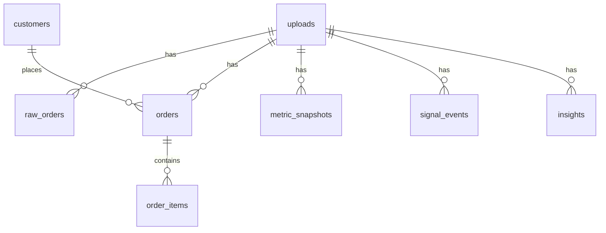

# Cấu trúc database (NosaProfit)

Tài liệu phản ánh **schema hiện tại** theo các model SQLAlchemy trong `app/models/`. Engine: **MySQL** qua `pymysql` (xem `app/database.py`, `app/config.py`).

## Quy ước chung

- **ORM**: SQLAlchemy 2.0 (`Mapped`, `mapped_column`, `relationship`).
- **Base**: `app.models.base.Base` (`DeclarativeBase`).
- **Timestamp**: Mọi bảng dùng `TimestampMixin` (`app/models/mixins.py`):
  - `created_at`: `DateTime`, server default `CURRENT_TIMESTAMP`
  - `updated_at`: `DateTime`, server default `CURRENT_TIMESTAMP`, ORM `onupdate` khi cập nhật
- **Tiền tệ**: `Numeric(18, 2)` cho đơn hàng/dòng hàng; `Numeric(24, 8)` cho metric/signal.
- **Khóa ngoại**: Xóa upload → cascade xóa `raw_orders`, `orders`, `metric_snapshots`, `signal_events`, `insights`; xóa order → cascade `order_items`; xóa customer → `orders.customer_id` **SET NULL**.

## Sơ đồ quan hệ (tóm tắt)

---

## Bảng `uploads`

Theo dõi từng lần tải/nhập dữ liệu.

| Thuộc tính Python | Cột DB   | Kiểu        | Ghi chú                          |
|-------------------|----------|-------------|----------------------------------|
| `id`              | `id`     | Integer PK  | autoincrement                    |
| `file_name`       | `filename` | String(512) | **Tên cột DB khác tên thuộc tính** |
| `status`          | `status` | String(32)  | có index, default `uploaded`     |
| `row_count`       | `row_count` | Integer  | nullable                         |
| `error_message`   | `error_message` | Text | nullable                    |
| `created_at`      |          | DateTime    | mixin                            |
| `updated_at`      |          | DateTime    | mixin                            |

**Quan hệ**: `raw_orders`, `orders`, `metric_snapshots`, `signal_events`, `insights` (cascade delete-orphan theo model).

---

## Bảng `raw_orders`

Dòng CSV thô để audit / xử lý lại.

| Thuộc tính Python | Cột DB       | Kiểu           | Ghi chú |
|-------------------|--------------|----------------|---------|
| `id`              | `id`         | Integer PK     |         |
| `upload_id`       | `upload_id`  | FK → `uploads.id` ON DELETE CASCADE | index |
| `row_number`      | `row_index`  | Integer        | **Tên cột DB: `row_index`** |
| `raw_payload_json`| `raw_payload`| MySQL JSON     | **Tên cột DB: `raw_payload`** |
| `created_at`      |              | DateTime       | mixin   |
| `updated_at`      |              | DateTime       | mixin   |

**Index**: composite `ix_raw_orders_upload_row` (`upload_id`, `row_index`).

---

## Bảng `customers`

Khách hàng chuẩn hóa (không có các trường tổng hợp như `total_orders` trong model hiện tại).

| Thuộc tính   | Kiểu           | Ghi chú        |
|--------------|----------------|----------------|
| `id`         | Integer PK     |                |
| `external_id`| String(64)     | nullable       |
| `email`      | String(320)    | nullable, index|
| `first_name` | String(255)    | nullable       |
| `last_name`  | String(255)    | nullable       |
| `created_at` | DateTime       | mixin          |
| `updated_at` | DateTime       | mixin          |

**Quan hệ**: `orders` (one-to-many).

---

## Bảng `orders`

Một bản ghi mỗi đơn (theo upload).

| Thuộc tính           | Kiểu              | Ghi chú |
|----------------------|-------------------|---------|
| `id`                 | Integer PK        |         |
| `upload_id`          | FK → `uploads.id` CASCADE |     |
| `external_order_id`  | String(64)        | nullable |
| `order_name`         | String(128)       | NOT NULL |
| `order_date`         | DateTime          | nullable |
| `currency`           | String(8)         | nullable |
| `financial_status`   | String(64)        | nullable |
| `fulfillment_status` | String(64)        | nullable |
| `source_name`        | String(128)       | nullable |
| `customer_id`        | FK → `customers.id` SET NULL | nullable |
| `shipping_country`   | String(128)       | nullable |
| `subtotal_price` … `net_revenue` | Numeric(18,2) | nullable (các cột tiền) |
| `total_quantity`     | Integer           | nullable |
| `is_cancelled`       | Boolean           | default false |
| `is_repeat_customer` | Boolean           | default false |
| `notes`              | Text              | nullable |
| `created_at` / `updated_at` | DateTime | mixin |

**Index**: `ix_orders_upload_id`, `ix_orders_external_id`, `ix_orders_order_date`, `ix_orders_source_name`, `ix_orders_customer_id`.

**Quan hệ**: `upload`, `customer`, `items` (`order_items`).

---

## Bảng `order_items`

Dòng sản phẩm trong đơn.

| Thuộc tính            | Kiểu        | Ghi chú |
|-----------------------|-------------|---------|
| `id`                  | Integer PK  |         |
| `order_id`            | FK → `orders.id` CASCADE | NOT NULL |
| `sku`                 | String(128) | nullable |
| `product_name`        | String(512) | nullable |
| `variant_name`        | String(255) | nullable |
| `vendor`              | String(255) | nullable |
| `quantity`            | Integer     | default 1 |
| `unit_price` … `net_line_revenue` | Numeric(18,2) | nullable |
| `requires_shipping`   | Boolean     | default true |
| `raw_notes`           | Text        | nullable |
| `created_at` / `updated_at` | DateTime | mixin |

**Index**: `ix_order_items_order_id`, `ix_order_items_sku`, `ix_order_items_product_name`.

---

## Bảng `metric_snapshots`

Metric đã tính (dashboard, so sánh lịch sử).

| Thuộc tính     | Kiểu           | Ghi chú |
|----------------|----------------|---------|
| `id`           | Integer PK     |         |
| `upload_id`    | FK → `uploads.id` CASCADE | NOT NULL |
| `metric_code`  | String(128)    | NOT NULL |
| `metric_scope` | String(64)     | default `overall` |
| `dimension_1` / `dimension_2` | String(256) | nullable |
| `period_type`  | String(32)     | default `all_time` |
| `period_value` | String(64)     | nullable |
| `metric_value` | Numeric(24, 8) | NOT NULL |
| `created_at` / `updated_at` | DateTime | mixin |

**Index**: `ix_metric_snapshots_upload`, `ix_metric_snapshots_code`, `ix_metric_snapshots_scope`, `ix_metric_snapshots_upload_code` (`upload_id`, `metric_code`).

---

## Bảng `signal_events`

Tín hiệu nghiệp vụ phát hiện được.

| Thuộc tính            | Kiểu           | Ghi chú |
|-----------------------|----------------|---------|
| `id`                  | Integer PK     |         |
| `upload_id`           | FK → `uploads.id` CASCADE | NOT NULL |
| `signal_code`         | String(64)     | NOT NULL |
| `severity`            | String(16)     | default `info` |
| `entity_type`         | String(32)     | default `unknown` |
| `entity_key`          | String(256)    | nullable |
| `signal_value` / `threshold_value` | Numeric(24,8) | nullable |
| `signal_context_json` | MySQL JSON     | nullable |
| `created_at` / `updated_at` | DateTime | mixin |

**Index**: `ix_signal_events_upload`, `ix_signal_events_code`, `ix_signal_events_severity`.

---

## Bảng `insights`

Insight dạng narrative.

| Thuộc tính              | Kiểu        | Ghi chú |
|-------------------------|-------------|---------|
| `id`                    | Integer PK  |         |
| `upload_id`             | FK → `uploads.id` CASCADE | NOT NULL |
| `insight_code`          | String(128) | NOT NULL |
| `category`              | String(64)  | default `general` |
| `priority`              | String(16)  | default `normal` |
| `title`                 | String(512) | NOT NULL |
| `summary`               | Text        | NOT NULL |
| `implication_text`      | Text        | nullable |
| `recommended_action`    | Text        | nullable |
| `supporting_data_json`  | MySQL JSON  | nullable |
| `created_at` / `updated_at` | DateTime | mixin |

**Index**: `ix_insights_upload`, `ix_insights_category`, `ix_insights_priority`.

---

## Bảng `rule_definitions`

Metadata rule tùy chọn (YAML vẫn là nguồn chính trong MVP).

| Thuộc tính              | Kiểu        | Ghi chú |
|-------------------------|-------------|---------|
| `id`                    | Integer PK  |         |
| `rule_code`             | String(128) | NOT NULL, **unique** |
| `category`              | String(64)  | default `general` |
| `is_active`             | Boolean     | default true |
| `severity`              | String(16)  | default `info` |
| `condition_json`        | MySQL JSON  | nullable |
| `title_template`        | String(512) | nullable |
| `summary_template` … `action_template` | Text | nullable |
| `created_at` / `updated_at` | DateTime | mixin |

**Index**: `ix_rule_definitions_category`.

**FK**: Không liên kết với `uploads` trong model hiện tại.

---

## Khởi tạo schema trong code

- `init_db()` trong `app/database.py` gọi `Base.metadata.create_all()` (MVP; production nên dùng Alembic).
- Thư mục `migrations/` có skeleton Alembic; chưa có file `versions/` trong repo tại thời điểm ghi tài liệu.

## File nguồn tham chiếu

| Bảng              | Module                 |
|-------------------|------------------------|
| (base)            | `app/models/base.py`   |
| Timestamps        | `app/models/mixins.py` |
| uploads           | `app/models/upload.py` |
| raw_orders        | `app/models/raw_order.py` |
| customers         | `app/models/customer.py` |
| orders            | `app/models/order.py`  |
| order_items       | `app/models/order_item.py` |
| metric_snapshots  | `app/models/metric_snapshot.py` |
| signal_events     | `app/models/signal_event.py` |
| insights          | `app/models/insight.py` |
| rule_definitions  | `app/models/rule_definition.py` |

Export tập trung: `app/models/__init__.py`.
